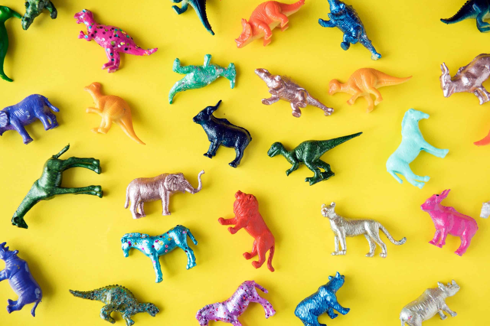
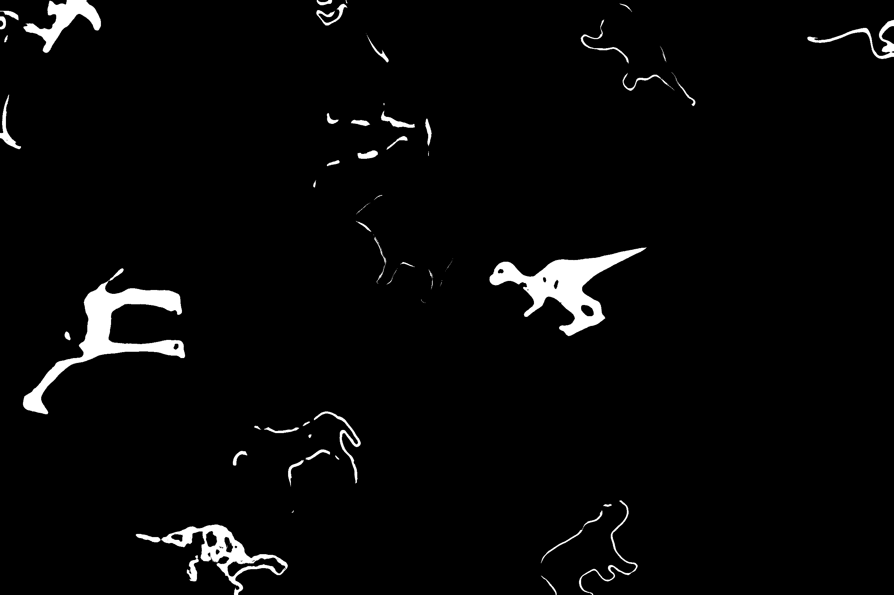
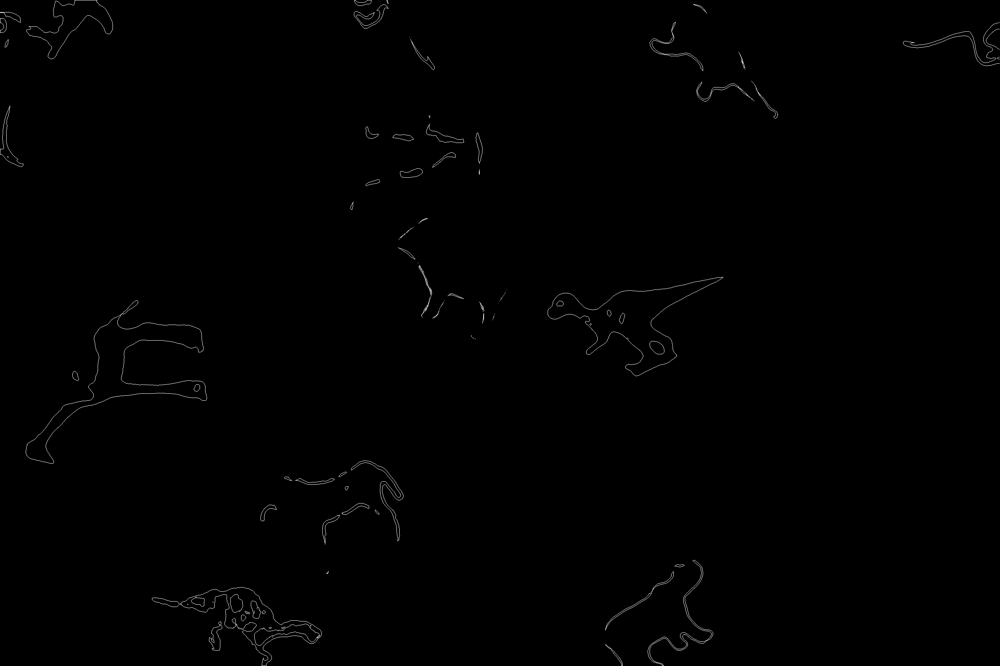
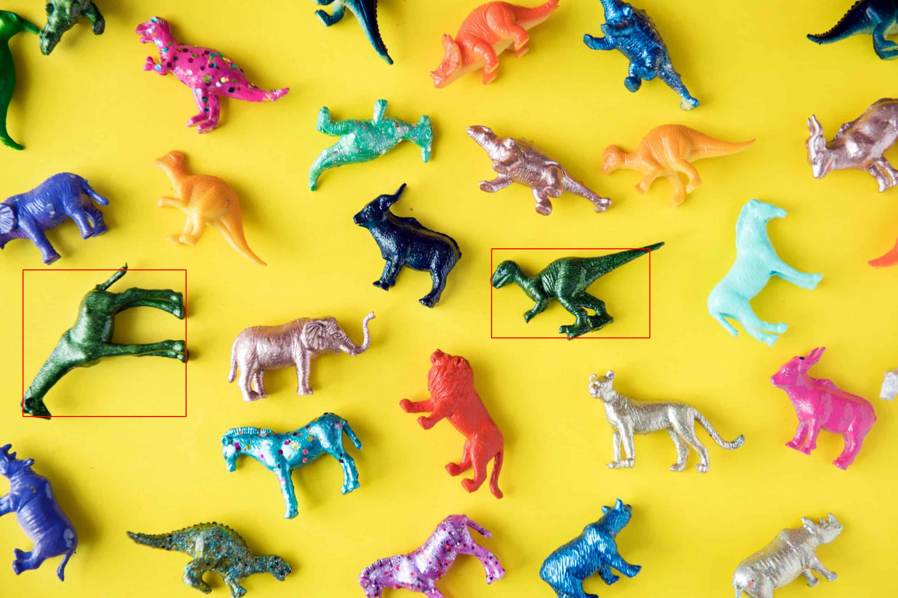

# SuzukiContourDetection

Python implementation Suzuki contours detection algorithm and find defined object(green dino) use HSV color model for create mask
## Original image

## Mask use HSV 

## Contours

## Result

